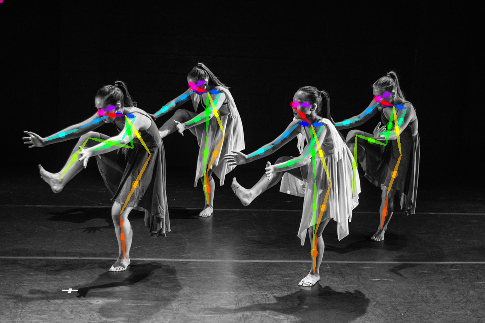

# keras-human-pose

A simple wrapper to localize human joints from images/video frames for multiple subjects.

### Download pre-trained weight

https://drive.google.com/file/d/1n-H_cvTHNldZuz08EE62WiVtqqXzemKq/view?usp=sharing

### Install all the libraries

pip install -r requirements.txt

### Sample Use

```
# import all the necessary modules
import keras
from keras.models import Sequential
from keras.models import Model
from keras.layers import Input, Dense, Activation, Lambda
from keras.layers.convolutional import Conv2D
from keras.layers.pooling import MaxPooling2D
from keras.layers.normalization import BatchNormalization
from keras.layers.merge import Concatenate
import scipy
import math
# import the pose estimation model and processing module
from PoseEstimationModel import *
from PoseEstimationProcessing import *

# load the pre-trained weights
pe = PoseEstimationModel('model.h5') 
pemodel = pe.create_model() # create the model

import cv2
import matplotlib
import pylab as plt
import numpy as np
# load a test image
test_image = 'test.jpg'

oriImg = cv2.imread(test_image) # B,G,R order
print(oriImg.shape)
plt.imshow(oriImg[:,:,[2,1,0]])


processor = PoseEstimationProcessing() # load the processor
shared_pts = processor.shared_points(pemodel, oriImg) # shared points across multiple subjects
subject_wise_loc = processor.subject_points(shared_pts)
subject_wise_loc = np.array(subject_wise_loc)

```

processor.subject_points() returns an array with shape (body parts, subject, X coordinate, Y coordinate)

Body parts mapping => [nose, neck, Rsho, Relb, Rwri, Lsho, Lelb, Lwri, Rhip, Rkne, Rank, Lhip, Lkne, Lank, Leye, Reye, Lear, Rear, pt19]

<p align="center">
  
</p>

### References
Most of codes are taken from https://github.com/michalfaber/keras_Realtime_Multi-Person_Pose_Estimation and simply re-written to simplify and extract the subject-wise data points.
